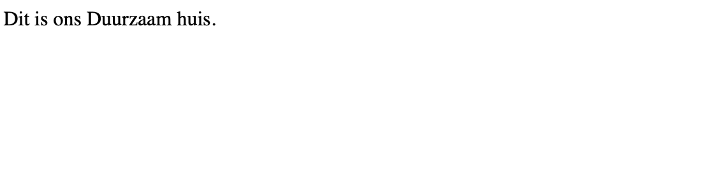

# Opdracht beschrijvingen

Je gaat oefenen met PHP in een HTML bestand. Hiervoor is een werkende MAMP omgeving noodzakelijk waarop je de opdrachten uitvoert.
Ook is een werkende productie omgeving nodig (ma-cloud) waarop je de live versies van je opdrachten laat zien.

Een opgeleverde opdracht is:
1. Code zichtbaar in Github.
2. Resultaat zichtbaar op ma-cloud.
3. Code voldoet aan de gevraagde eisen.
4. Je docent heeft jouw code goedgekeurd. Dus vraag de docenten om ernaar te kijken.

#### Als je er niet uitkomt vraag om hulp maar probeer het eerst zelf.

## Les 1. Opdracht 1.
1. Pas First php.html aan zodat deze door de webserver van MAMP wordt weergegeven.  
   De bedoeling is dat php script code die je straks gaat maken in dit bestand getoond wordt in de browser.
2. Maak een script tag aan voor je PHP code.
3. Zet in de script tag PHP code zodat je in  je browser het volgende toont zoals in de onderstaande afbeelding.   

   
   

## Les 1. Opdracht 2.
1. De bovenstaande afbeelding ziet er nogal saai uit en we voegen een klein beetje HTML toe aan je script.
2. Probeer de tekst weer te geven in een ```<H1>``` tag.
3. Het is niet de bedoeling dat je de ```<H1>``` tag om je PHP script zet maar de tag in je script opneemt.

## Les 1. Opdracht 3.
1. Gebruik de functie echo om teksten op het scherm te zetten.
2. Gebruik ook de functie print om teksten op het scherm te zetten.
3. Gebruik de functie printf om teksten op het scherm te zetten.

Informatie over:  
```
   - echo 
   - print 
   - printf
```
kun je vinden op de volgende pagina [PHP.net](https://www.php.net/manual/en/function.echo.php) 

## Les 2. Opdracht 1.
De beschrijving hiervoor staat in het PDF document.
(Duurzaam huis backend programmeren Week 1.pdf)
